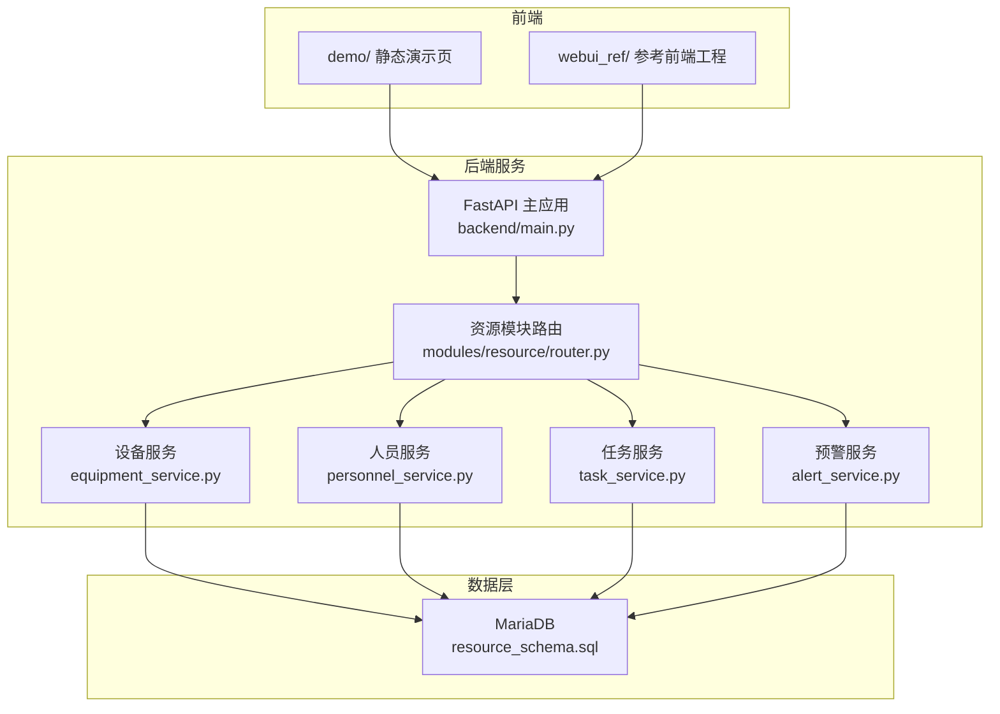
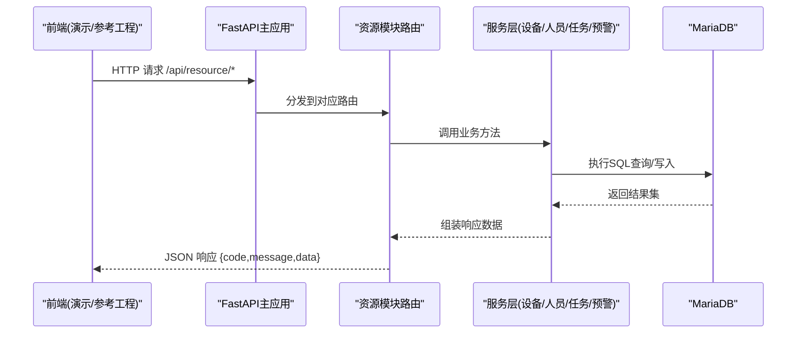
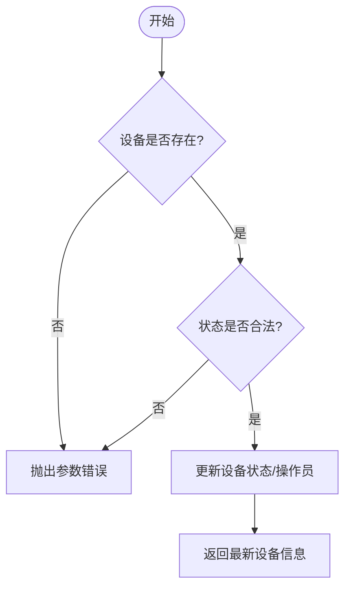
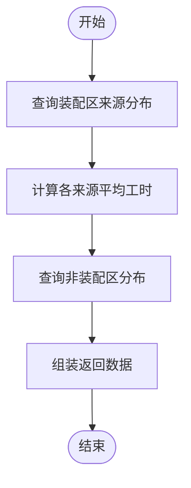
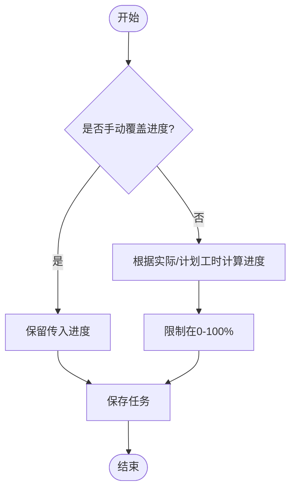
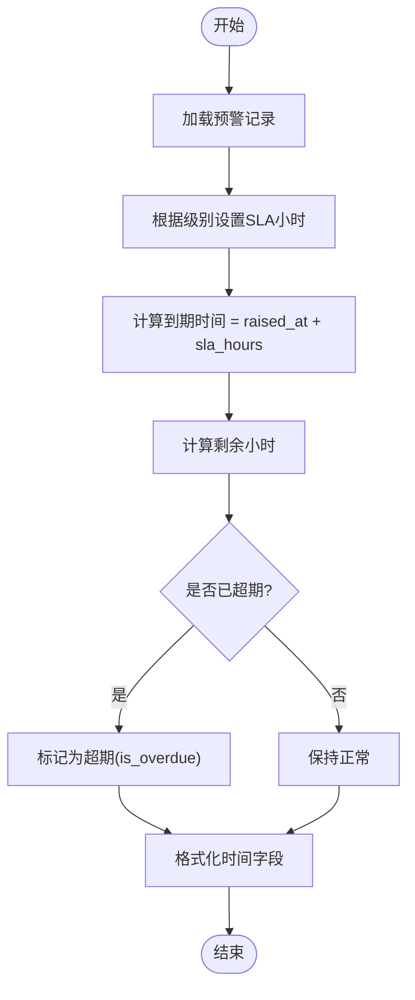
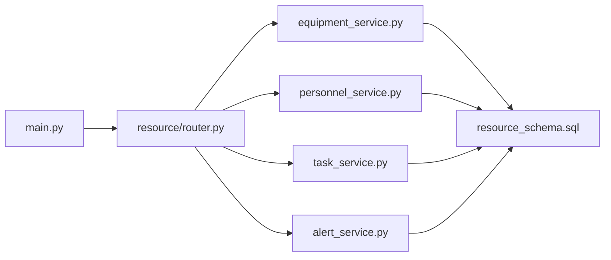
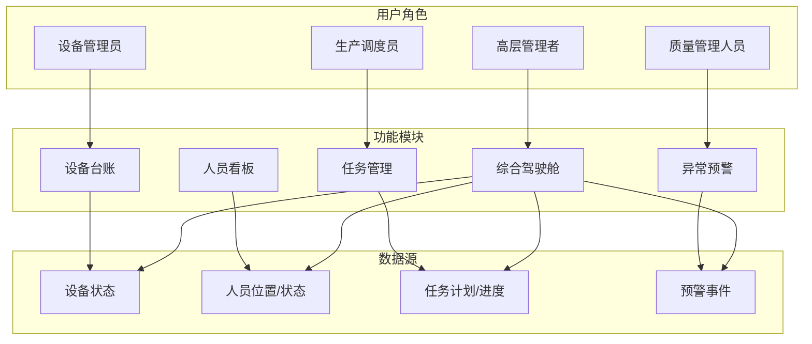
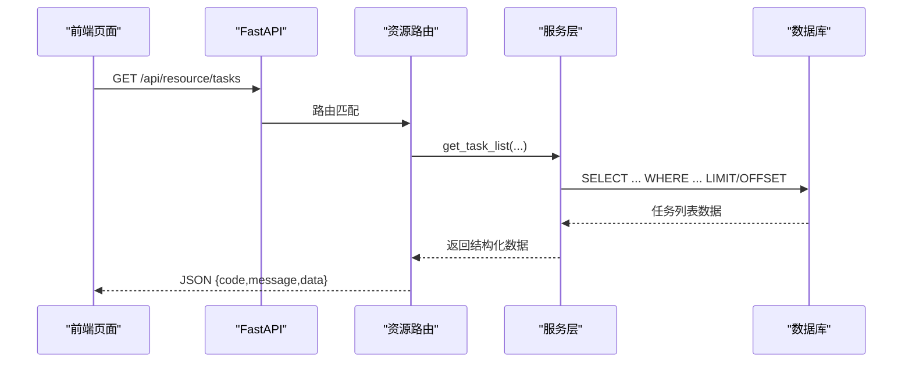

# 系统介绍

<cite>
**本文引用的文件**
- [README.md](file://README.md)
- [需求文档_V6_试制资源数智化管理系统.md](file://需求文档_V6_试制资源数智化管理系统.md)
- [backend/main.py](file://backend/main.py)
- [backend/config.py](file://backend/config.py)
- [backend/modules/resource/router.py](file://backend/modules/resource/router.py)
- [backend/modules/resource/services/equipment_service.py](file://backend/modules/resource/services/equipment_service.py)
- [backend/modules/resource/services/personnel_service.py](file://backend/modules/resource/services/personnel_service.py)
- [backend/modules/resource/services/task_service.py](file://backend/modules/resource/services/task_service.py)
- [backend/modules/resource/services/alert_service.py](file://backend/modules/resource/services/alert_service.py)
- [backend/sql/resource_schema.sql](file://backend/sql/resource_schema.sql)
- [demo/dashboard.html](file://demo/dashboard.html)
</cite>

## 目录
1. [引言](#引言)
2. [项目结构](#项目结构)
3. [核心组件](#核心组件)
4. [架构总览](#架构总览)
5. [详细组件分析](#详细组件分析)
6. [依赖关系分析](#依赖关系分析)
7. [性能与可用性](#性能与可用性)
8. [故障排查指南](#故障排查指南)
9. [结论](#结论)
10. [附录：业务架构图与数据流图](#附录业务架构图与数据流图)

## 引言
本系统为“试制资源数智化管理系统”，聚焦试制车间的设备、人员、任务、排程与异常预警，目标是实现全资源的实时监控与智能调配。通过设备台账、人员看板、任务管理、排程调度、异常预警等模块，帮助车间提升设备利用率、优化人员调度、缩短异常响应时间，并以数据驱动决策，支撑生产计划与质量管控。

核心价值与业务价值
- 设备利用率低：通过设备状态监控、维护记录与占用看板，识别闲置与瓶颈，辅助合理排产。
- 人员调度困难：以人员位置、来源、工作负载为核心维度，支持快速调配与可视化看板。
- 异常响应不及时：建立分级预警与SLA机制，自动计算剩余处理时长并提示超期，推动闭环处理。
- 数据驱动决策：综合驾驶舱聚合KPI、趋势与分布，提供全局视角与问题定位入口。

目标用户与使用场景
- 设备管理员：设备台账维护、状态更新、维护记录查看与统计。
- 生产调度员：任务编排、甘特图排程、资源冲突检测与调整。
- 质量管理人员：异常预警登记、升级、整改与效果验证。
- 高层管理者：综合驾驶舱查看关键指标、趋势与风险点，进行经营决策。

## 项目结构
系统采用前后端分离架构：后端基于 FastAPI 提供 RESTful API；前端参考工程位于 webui_ref（React + TypeScript），另有静态演示页 demo/ 可直接浏览器打开预览。数据库为 MariaDB（兼容 MySQL），包含设备、区域、人员、任务、预警、效率与维护等表。

图表来源
- [backend/main.py:11-83](file://backend/main.py#L11-L83)
- [backend/modules/resource/router.py:1-15](file://backend/modules/resource/router.py#L1-L15)
- [backend/sql/resource_schema.sql:1-10](file://backend/sql/resource_schema.sql#L1-L10)

章节来源
- [README.md:7-16](file://README.md#L7-L16)
- [backend/main.py:11-83](file://backend/main.py#L11-L83)
- [backend/config.py:48-98](file://backend/config.py#L48-L98)

## 核心组件
- 设备台账：设备信息CRUD、状态管理、维护记录、统计数据。
- 人员看板：人员信息CRUD、状态与位置、来源分布、地图覆盖层数据。
- 任务管理：三类任务（零星/ABC类/试制岛）的CRUD、进度自动/手动计算、统计与趋势。
- 异常预警中心：预警创建、查询、批量处理、SLA与升级、统计与趋势。
- 综合驾驶舱：KPI汇总、设备/人员状态分布、资源利用率、最近预警。

章节来源
- [backend/modules/resource/router.py:16-800](file://backend/modules/resource/router.py#L16-L800)
- [backend/modules/resource/services/equipment_service.py:11-335](file://backend/modules/resource/services/equipment_service.py#L11-L335)
- [backend/modules/resource/services/personnel_service.py:24-475](file://backend/modules/resource/services/personnel_service.py#L24-L475)
- [backend/modules/resource/services/task_service.py:21-432](file://backend/modules/resource/services/task_service.py#L21-L432)
- [backend/modules/resource/services/alert_service.py:47-399](file://backend/modules/resource/services/alert_service.py#L47-L399)

## 架构总览
系统以 FastAPI 作为统一入口，注册各业务模块路由；资源模块按领域拆分服务层，负责具体业务逻辑与数据库访问；数据库采用 MariaDB，表结构由脚本初始化。前端通过 /api/resource/* 调用接口获取数据，展示在驾驶舱与各业务页面中。

图表来源
- [backend/main.py:74-83](file://backend/main.py#L74-L83)
- [backend/modules/resource/router.py:58-800](file://backend/modules/resource/router.py#L58-L800)
- [backend/sql/resource_schema.sql:10-163](file://backend/sql/resource_schema.sql#L10-L163)

## 详细组件分析

### 设备台账组件
职责
- 设备列表查询（分页、筛选、搜索）
- 设备详情、新增、编辑、删除
- 设备状态更新（空闲/占用/故障/维护）
- 维护记录CRUD与状态流转
- 设备统计数据（用于驾驶舱）

关键流程（状态更新）

图表来源
- [backend/modules/resource/services/equipment_service.py:262-301](file://backend/modules/resource/services/equipment_service.py#L262-L301)

章节来源
- [backend/modules/resource/router.py:58-303](file://backend/modules/resource/router.py#L58-L303)
- [backend/modules/resource/services/equipment_service.py:11-495](file://backend/modules/resource/services/equipment_service.py#L11-L495)
- [backend/sql/resource_schema.sql:10-29](file://backend/sql/resource_schema.sql#L10-L29)

### 人员看板组件
职责
- 人员列表查询（分页、筛选、搜索）
- 人员详情、新增、编辑、删除
- 人员状态与位置更新
- 人员来源分布（装配区与非装配区分组）
- 地图覆盖层数据（区域人数与明细）

关键流程（来源分布）

图表来源
- [backend/modules/resource/services/personnel_service.py:382-431](file://backend/modules/resource/services/personnel_service.py#L382-L431)

章节来源
- [backend/modules/resource/router.py:333-578](file://backend/modules/resource/router.py#L333-L578)
- [backend/modules/resource/services/personnel_service.py:24-475](file://backend/modules/resource/services/personnel_service.py#L24-L475)
- [backend/sql/resource_schema.sql:47-66](file://backend/sql/resource_schema.sql#L47-L66)

### 任务管理组件
职责
- 任务列表查询（多条件筛选、关键词搜索）
- 任务详情、新增、编辑、删除
- 进度自动计算（实际工时/计划工时）或手动覆盖
- 任务统计、类型与进度对比、月度趋势

关键流程（进度计算）

图表来源
- [backend/modules/resource/services/task_service.py:21-45](file://backend/modules/resource/services/task_service.py#L21-L45)

章节来源
- [backend/modules/resource/router.py:581-800](file://backend/modules/resource/router.py#L581-L800)
- [backend/modules/resource/services/task_service.py:48-432](file://backend/modules/resource/services/task_service.py#L48-L432)
- [backend/sql/resource_schema.sql:68-109](file://backend/sql/resource_schema.sql#L68-L109)

### 异常预警组件
职责
- 预警列表查询（多条件筛选、关键词、超期过滤）
- 预警详情、创建、更新、批量处理
- SLA自动填充与剩余时长计算
- 预警统计（级别、状态、类型、近7天趋势、升级数量）

关键流程（SLA与超期）

图表来源
- [backend/modules/resource/services/alert_service.py:33-44](file://backend/modules/resource/services/alert_service.py#L33-L44)
- [backend/modules/resource/services/alert_service.py:143-172](file://backend/modules/resource/services/alert_service.py#L143-L172)

章节来源
- [backend/modules/resource/services/alert_service.py:47-399](file://backend/modules/resource/services/alert_service.py#L47-L399)
- [backend/sql/resource_schema.sql:111-163](file://backend/sql/resource_schema.sql#L111-L163)

### 综合驾驶舱
功能
- KPI汇总：设备总数、占用率、在线人员、进行中任务、今日完工、异常告警
- 设备状态分布、人员状态分布、资源利用率、最近预警
- 数据来源：设备/人员/任务/预警服务的统计接口

章节来源
- [backend/modules/resource/router.py:204-218](file://backend/modules/resource/router.py#L204-L218)
- [backend/modules/resource/services/equipment_service.py:304-335](file://backend/modules/resource/services/equipment_service.py#L304-L335)
- [backend/modules/resource/services/personnel_service.py:325-379](file://backend/modules/resource/services/personnel_service.py#L325-L379)
- [backend/modules/resource/services/task_service.py:290-332](file://backend/modules/resource/services/task_service.py#L290-L332)
- [backend/modules/resource/services/alert_service.py:337-399](file://backend/modules/resource/services/alert_service.py#L337-L399)
- [demo/dashboard.html:1-200](file://demo/dashboard.html#L1-L200)

## 依赖关系分析
- 主应用 main.py 负责启动 FastAPI、注册CORS、挂载各模块路由（包括资源模块）。
- 资源模块 router.py 将HTTP请求分派到对应服务层。
- 服务层封装业务规则与数据库操作，依赖 database 工具函数与 logger。
- 数据库 schema 由 resource_schema.sql 定义，涵盖设备、区域、人员、任务、预警、效率、维护、甘特排程与冲突表。

图表来源
- [backend/main.py:74-83](file://backend/main.py#L74-L83)
- [backend/modules/resource/router.py:1-15](file://backend/modules/resource/router.py#L1-L15)
- [backend/sql/resource_schema.sql:10-163](file://backend/sql/resource_schema.sql#L10-L163)

章节来源
- [backend/main.py:74-83](file://backend/main.py#L74-L83)
- [backend/modules/resource/router.py:1-15](file://backend/modules/resource/router.py#L1-L15)
- [backend/sql/resource_schema.sql:10-163](file://backend/sql/resource_schema.sql#L10-L163)

## 性能与可用性
- 数据库索引：设备、人员、任务、预警等表均对常用查询字段建立索引，提升筛选与统计性能。
- 分页与筛选：列表接口普遍支持分页与多维度筛选，避免一次性拉取大量数据。
- 实时性：前端演示页与参考工程可通过定时刷新或轮询获取最新数据（如驾驶舱30秒刷新）。
- 可扩展性：服务层按领域拆分，便于新增模块与扩展能力（如接入MES/运营表同步）。

[本节为通用指导，不直接分析具体文件]

## 故障排查指南
常见问题与建议
- 数据库连接失败：检查 backend/.env 中的数据库配置（主机、端口、用户名、密码、库名）。
- 路由未生效：确认 main.py 中已 include_router 资源模块路由。
- 数据为空：确认已执行 init_resource_db.py 与 resource_schema.sql 建表与初始化数据。
- 预警超期不显示：检查 raised_at 与 sla_hours 是否正确设置，确认 overdue_only 过滤逻辑。

章节来源
- [backend/config.py:48-98](file://backend/config.py#L48-L98)
- [backend/main.py:74-83](file://backend/main.py#L74-L83)
- [backend/modules/resource/services/alert_service.py:143-172](file://backend/modules/resource/services/alert_service.py#L143-L172)

## 结论
本系统围绕试制车间的核心资源（设备、人员、任务）构建统一的数智化管理平台，通过实时监控、智能排程与异常预警，显著提升设备利用率、优化人员调度、缩短异常响应时间。结合综合驾驶舱的数据可视化，管理层可快速掌握运行态势并做出科学决策。未来可进一步对接MES与运营表，完善自动化同步与高级排程算法，持续增强系统的智能化水平。

[本节为总结性内容，不直接分析具体文件]

## 附录：业务架构图与数据流图

### 业务架构图

[此图为概念性业务架构示意，不映射具体代码文件]

### 数据流图（从前端到数据库）

图表来源
- [backend/modules/resource/router.py:646-678](file://backend/modules/resource/router.py#L646-L678)
- [backend/modules/resource/services/task_service.py:48-146](file://backend/modules/resource/services/task_service.py#L48-L146)
- [backend/sql/resource_schema.sql:68-109](file://backend/sql/resource_schema.sql#L68-L109)