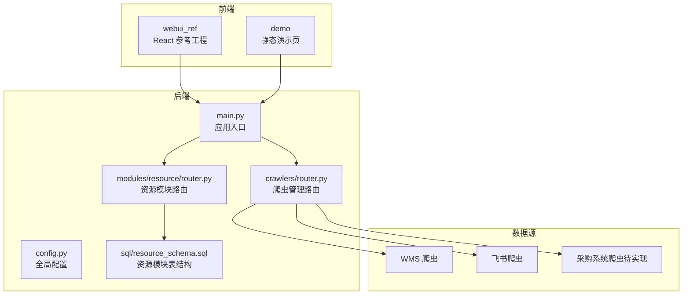
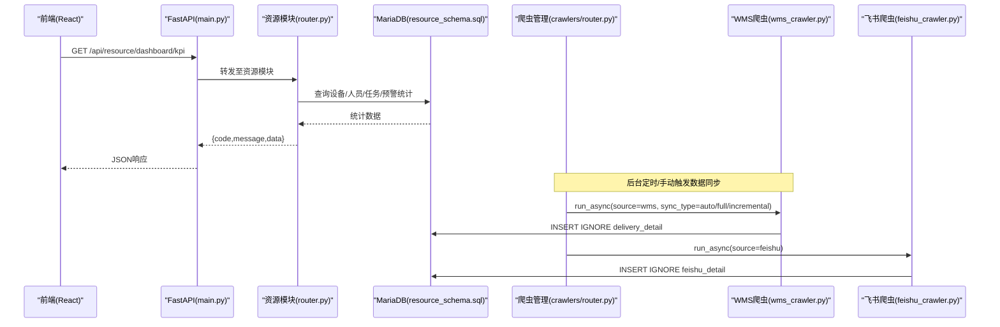
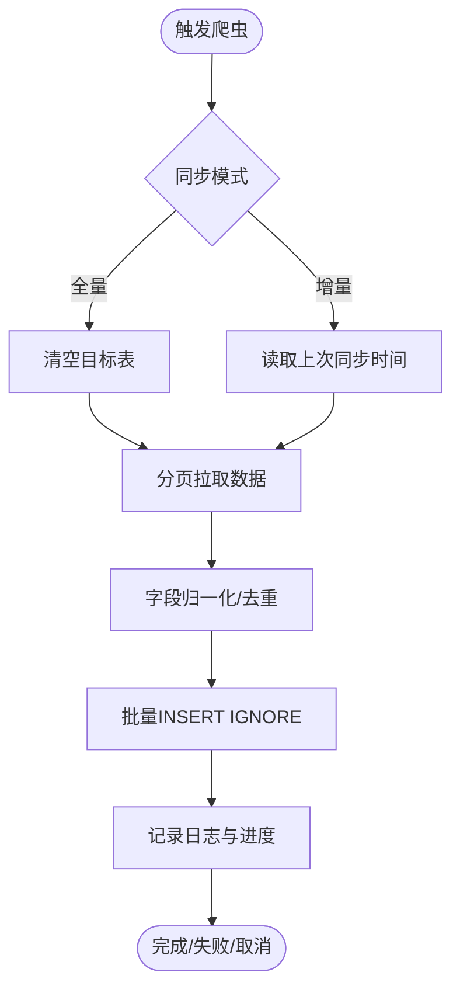
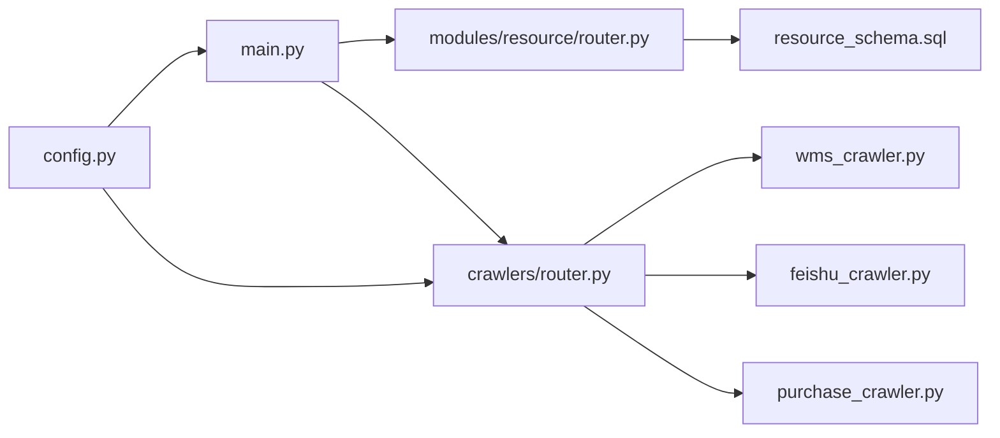

# 项目概述

<cite>
**本文引用的文件**
- [README.md](file://README.md)
- [需求文档_V6_试制资源数智化管理系统.md](file://需求文档_V6_试制资源数智化管理系统.md)
- [backend/main.py](file://backend/main.py)
- [backend/config.py](file://backend/config.py)
- [backend/modules/resource/router.py](file://backend/modules/resource/router.py)
- [backend/sql/resource_schema.sql](file://backend/sql/resource_schema.sql)
- [backend/crawlers/router.py](file://backend/crawlers/router.py)
- [backend/crawlers/wms_crawler.py](file://backend/crawlers/wms_crawler.py)
- [backend/crawlers/feishu_crawler.py](file://backend/crawlers/feishu_crawler.py)
- [backend/crawlers/purchase_crawler.py](file://backend/crawlers/purchase_crawler.py)
</cite>

## 目录
1. [引言](#引言)
2. [项目结构](#项目结构)
3. [核心组件](#核心组件)
4. [架构总览](#架构总览)
5. [详细组件分析](#详细组件分析)
6. [依赖关系分析](#依赖关系分析)
7. [性能与可靠性](#性能与可靠性)
8. [故障排查指南](#故障排查指南)
9. [结论](#结论)
10. [附录：快速开始](#附录快速开始)

## 引言
本系统为“试制资源数智化管理系统”，定位为试制车间的资源管理子系统，聚焦设备台账、人员看板、任务调度、排程调度、异常预警等能力，实现全资源的实时监控与智能调配。系统通过多源数据集成（WMS、飞书共享表、采购系统预留）汇聚到货与任务信息，结合数据库与调度器，支撑前端驾驶舱与各业务模块的实时展示与交互。

核心价值
- 统一资源视图：设备、人员、区域、任务集中管理，形成车间级“一张图”。
- 多源数据融合：WMS/飞书/采购等多渠道数据自动同步，减少人工录入与误差。
- 实时可视与预警：综合驾驶舱与异常预警中心，快速定位问题并闭环处理。
- 排程与冲突检测：甘特图排程支持拖拽调整、关键路径与资源冲突提示。
- 可运维可扩展：模块化路由与服务层设计，便于新增模块与数据源接入。

目标用户
- 试制车间管理员、工艺主管、调度员、质量与生产管理人员。

技术栈概览
- 后端：FastAPI + MariaDB（MySQL兼容），提供 /api/* RESTful 接口。
- 前端参考工程：React + TypeScript + Vite + ECharts 5，位于 webui_ref/。
- 演示页：静态 HTML/CSS/JS + ECharts，位于 demo/，可直接浏览器打开。
- 数据库：MariaDB 10.x（或 MySQL 5.7+），默认库名 warehouse_data。

章节来源
- [README.md:7-15](file://README.md#L7-L15)
- [需求文档_V6_试制资源数智化管理系统.md:11-21](file://需求文档_V6_试制资源数智化管理系统.md#L11-L21)

## 项目结构
仓库采用前后端分离与模块化组织：
- backend：FastAPI 后端服务，包含资源模块、爬虫管理、PBOM、项目、QR到件、交付融合、关键件评分、排程调度、系统设置等。
- webui_ref：React 前端参考工程，含 9 大模块页面与 UI 组件库。
- demo：纯静态演示页，无需安装依赖即可预览原型。
- sql：资源模块建表与初始化脚本。
- scripts：运维脚本（数据库初始化、配置探测、爬虫运行等）。

图表来源
- [backend/main.py:18-83](file://backend/main.py#L18-L83)
- [backend/modules/resource/router.py:1-15](file://backend/modules/resource/router.py#L1-L15)
- [backend/crawlers/router.py:1-13](file://backend/crawlers/router.py#L1-L13)
- [backend/config.py:48-98](file://backend/config.py#L48-L98)
- [backend/sql/resource_schema.sql:11-326](file://backend/sql/resource_schema.sql#L11-L326)

章节来源
- [README.md:16-54](file://README.md#L16-L54)

## 核心组件
- 应用入口与生命周期：启动时加载 CORS、注册路由、启动调度器；关闭时停止调度器与爬虫管理器。
- 配置中心：集中读取数据库、爬虫间隔、WMS/飞书/采购系统地址与密钥、服务端口、CORS、上传目录等。
- 资源模块：设备、人员、任务、区域、预警、效率统计、维护记录等 CRUD 与统计接口。
- 爬虫管理：WMS、飞书、采购系统的数据抓取与入库，支持增量/全量、异步执行、日志轮询、调度控制。
- 数据库：资源模块专用表结构，覆盖设备、区域、人员、任务、预警、效率、维护、甘特排程与冲突检测。

章节来源
- [backend/main.py:29-83](file://backend/main.py#L29-L83)
- [backend/config.py:48-98](file://backend/config.py#L48-L98)
- [backend/modules/resource/router.py:16-800](file://backend/modules/resource/router.py#L16-L800)
- [backend/crawlers/router.py:43-225](file://backend/crawlers/router.py#L43-L225)
- [backend/sql/resource_schema.sql:11-326](file://backend/sql/resource_schema.sql#L11-L326)

## 架构总览
系统采用前后端分离架构：
- 前端（React）通过 API 调用后端 FastAPI 服务，获取资源数据与可视化所需指标。
- 后端负责业务逻辑、数据持久化、外部系统集成与定时调度。
- 多源数据通过爬虫模块拉取并写入数据库，供资源模块聚合展示。

图表来源
- [backend/main.py:74-83](file://backend/main.py#L74-L83)
- [backend/modules/resource/router.py:724-732](file://backend/modules/resource/router.py#L724-L732)
- [backend/crawlers/router.py:89-147](file://backend/crawlers/router.py#L89-L147)
- [backend/crawlers/wms_crawler.py:313-457](file://backend/crawlers/wms_crawler.py#L313-L457)
- [backend/crawlers/feishu_crawler.py:251-399](file://backend/crawlers/feishu_crawler.py#L251-L399)
- [backend/sql/resource_schema.sql:11-326](file://backend/sql/resource_schema.sql#L11-L326)

## 详细组件分析

### 应用入口与生命周期
- 启动事件：自动启动后端调度器，确保定时任务生效。
- 关闭事件：安全停止调度器与爬虫管理器，避免资源泄漏。
- 路由注册：按模块前缀挂载路由，如 /api/resource、/api/crawlers、/api/system 等。
- SPA回退：若存在静态首页，则非 API 请求返回 index.html，支持单页应用部署。

章节来源
- [backend/main.py:36-55](file://backend/main.py#L36-L55)
- [backend/main.py:74-83](file://backend/main.py#L74-L83)
- [backend/main.py:99-118](file://backend/main.py#L99-L118)

### 配置中心
- 环境变量加载：从 .env 读取数据库、爬虫间隔、WMS/飞书/采购系统地址与密钥、服务端口、CORS、上传目录等。
- 类型转换：提供整数、布尔、列表等安全读取方法，非法值回退默认。
- QR基础URL：用于生成二维码中的访问地址。

章节来源
- [backend/config.py:12-22](file://backend/config.py#L12-L22)
- [backend/config.py:25-46](file://backend/config.py#L25-L46)
- [backend/config.py:48-98](file://backend/config.py#L48-L98)

### 资源模块（设备/人员/任务/区域/预警/效率/维护）
- 设备台账：增删改查、状态更新、维护记录、统计接口。
- 人员看板：列表、详情、状态更新、来源分布、地图位置、效率统计。
- 任务管理：三类任务（零星/ABC类/试制岛）CRUD、状态与进度更新、统计与甘特数据。
- 区域与地图：区域列表与地图数据接口（占位实现，后续扩展）。
- 异常预警：列表、详情、处理与解决、统计、触发检测。
- 人效分析：汇总与明细接口（占位实现，后续扩展）。

章节来源
- [backend/modules/resource/router.py:16-800](file://backend/modules/resource/router.py#L16-L800)

### 爬虫管理（WMS/飞书/采购）
- 统一路由：配置读写、状态查询、任务执行摘要、调度器启停、任务停止。
- WMS爬虫：登录鉴权、分页拉取、增量/全量模式、时间过滤、批量插入、重试机制。
- 飞书爬虫：Token获取、表格分页读取、字段映射与归一化、增量过滤、批量入库。
- 采购爬虫：预留接口，当前返回未实现提示。

图表来源
- [backend/crawlers/router.py:89-147](file://backend/crawlers/router.py#L89-L147)
- [backend/crawlers/wms_crawler.py:313-457](file://backend/crawlers/wms_crawler.py#L313-L457)
- [backend/crawlers/feishu_crawler.py:251-399](file://backend/crawlers/feishu_crawler.py#L251-L399)

章节来源
- [backend/crawlers/router.py:43-225](file://backend/crawlers/router.py#L43-L225)
- [backend/crawlers/wms_crawler.py:44-477](file://backend/crawlers/wms_crawler.py#L44-L477)
- [backend/crawlers/feishu_crawler.py:55-419](file://backend/crawlers/feishu_crawler.py#L55-L419)
- [backend/crawlers/purchase_crawler.py:12-49](file://backend/crawlers/purchase_crawler.py#L12-L49)

### 数据库模型（资源模块）
- 设备表 equipment：编号、名称、类型、区域、状态、当前任务/操作员、更新时间。
- 区域表 zones：编码、名称、类型、地图坐标、网格行列。
- 人员表 personnel：工号、姓名、头像文字、来源部门、状态、所在区域、当前任务、上班时间。
- 任务表 tasks：编号、名称、类型、试制类别、项目群/编号、车号/车型、优先级、状态、区域/场地、举升机数量、设备、负责人、计划与实际工时、进度、来源。
- 异常预警表 alerts：编号、类型、级别、标题、描述、来源、关联对象、区域/场地、SLA、升级、处理流程、损失与影响、附件计数、备注。
- 人员效率统计表 personnel_efficiency：工号、日期、总工时、有效工时、完成任务数、设备使用率、主要区域。
- 设备维护记录表 equipment_maintenance：设备编号、维护类型、起止时间、维护人员、描述、状态。
- 甘特排程计划表 gantt_schedules：排程编号、关联任务、阶段、优先级、状态、颜色标签、场地/区域、举升机数量、设备、负责人、计划/实际时间、进度、父子层级、约束、关键路径、冲突标记。
- 甘特资源分配表 gantt_resource_allocations：排程ID、资源类型/编码/名称、占用时间、分配工时/数量、优先级、状态。
- 甘特资源冲突表 gantt_conflicts：冲突编号、类型、严重级别、关联排程、资源、重叠时间、建议、处理流程、装配场地。

章节来源
- [backend/sql/resource_schema.sql:11-326](file://backend/sql/resource_schema.sql#L11-L326)

## 依赖关系分析
- 模块耦合：main.py 作为入口，聚合各模块路由；resource 模块依赖数据库表结构与配置；crawler 模块依赖配置与数据库，并通过统一路由暴露控制能力。
- 外部依赖：WMS/飞书/采购系统通过爬虫模块对接，具备超时重试、增量/全量、日志与进度上报。
- 潜在循环：无直接循环导入；调度器在启动事件中按需导入，避免启动期循环依赖。
- 接口契约：统一响应格式 { code, message, data }，时间格式 ISO 8601。

图表来源
- [backend/main.py:18-83](file://backend/main.py#L18-L83)
- [backend/modules/resource/router.py:1-15](file://backend/modules/resource/router.py#L1-L15)
- [backend/crawlers/router.py:1-13](file://backend/crawlers/router.py#L1-L13)
- [backend/config.py:48-98](file://backend/config.py#L48-L98)

章节来源
- [backend/main.py:18-83](file://backend/main.py#L18-L83)
- [backend/config.py:48-98](file://backend/config.py#L48-L98)

## 性能与可靠性
- 爬虫性能
  - 分页拉取与批量插入：WMS/飞书爬虫均使用分页与批量写入，降低网络与数据库压力。
  - 增量同步：基于时间戳或最大时间字段，减少重复拉取与写入。
  - 重试与退避：网络超时与连接错误采用指数退避重试，提升稳定性。
  - 日志缓冲：限制日志条数，避免内存无限增长。
- 数据库性能
  - 索引优化：设备/人员/任务/预警/维护/甘特相关表建立常用字段索引，提升查询效率。
  - 去重策略：INSERT IGNORE 避免重复入库，保证数据一致性。
- 服务可靠性
  - 健康检查：/api/health 提供系统可用性探针。
  - 优雅退出：信号处理确保调度器与爬虫管理器正确停止。

章节来源
- [backend/crawlers/wms_crawler.py:180-213](file://backend/crawlers/wms_crawler.py#L180-L213)
- [backend/crawlers/wms_crawler.py:273-310](file://backend/crawlers/wms_crawler.py#L273-L310)
- [backend/crawlers/feishu_crawler.py:132-203](file://backend/crawlers/feishu_crawler.py#L132-L203)
- [backend/sql/resource_schema.sql:11-326](file://backend/sql/resource_schema.sql#L11-L326)
- [backend/main.py:94-98](file://backend/main.py#L94-L98)
- [backend/main.py:122-159](file://backend/main.py#L122-L159)

## 故障排查指南
- 爬虫配置与凭证
  - WMS：检查 authorization/cookie/username/password 是否配置正确；确认 LOGIN_URL/QUERY_URL 可达。
  - 飞书：确认 Token 获取成功，SPREADSHEET_TOKEN/SHEET_ID 正确。
  - 采购：当前未实现 API 接入，需后续开发。
- 同步模式与时间
  - 增量同步依赖 RECIVE_TIME 或最大时间字段；若为空将回退全量。
  - WMS 时间字段涉及 UTC/北京时间转换，注意时区差异。
- 日志与状态
  - 通过 /api/crawlers/status/{source} 查看运行日志与进度。
  - 通过 /api/crawlers/summary 获取整体摘要与调度器状态。
- 服务健康
  - 访问 /api/health 检查服务是否正常运行。
  - 关注启动/关闭事件日志，确认调度器与爬虫管理器状态。

章节来源
- [backend/crawlers/router.py:61-86](file://backend/crawlers/router.py#L61-L86)
- [backend/crawlers/router.py:150-177](file://backend/crawlers/router.py#L150-L177)
- [backend/crawlers/wms_crawler.py:64-109](file://backend/crawlers/wms_crawler.py#L64-L109)
- [backend/crawlers/feishu_crawler.py:205-220](file://backend/crawlers/feishu_crawler.py#L205-L220)
- [backend/main.py:94-98](file://backend/main.py#L94-L98)

## 结论
本系统以 FastAPI 后端与 React 前端为核心，围绕试制车间资源管理构建九大专属模块，并通过多源数据集成实现资源的实时监控与智能调配。系统具备良好的模块化、可扩展性与可运维性，适合在生产环境中持续迭代与扩展。

## 附录：快速开始
环境要求
- Python 3.9+
- MariaDB 10.x（或 MySQL 5.7+），数据库名 warehouse_data
- Node.js 22+ / npm 10+（仅前端参考工程需要）
- 演示页（demo/）无需任何依赖，浏览器直接打开即可

后端运行步骤
- 安装依赖：pip install -r backend/requirements.txt
- 配置环境变量：复制 backend/.env.example 为 backend/.env，填写数据库密码等
- 初始化基础数据库：python backend/scripts/init_db.py
- 初始化资源模块数据库：python backend/sql/init_resource_db.py
- 启动服务：python backend/main.py
- 默认服务地址：http://localhost:8000

前端参考工程
- 进入 webui_ref：npm install
- 启动开发服务器：npm run dev（默认端口 5173，已配置代理将 /api 转发至后端）
- 生产构建：npm run build

演示页
- 直接打开 demo/index.html 预览全部 9 个模块原型页面（使用模拟数据）

API 文档
- 启动后端后访问 http://localhost:8000/docs（Swagger UI）查看全部接口
- 接口规范：/api/resource/*，JSON 格式，响应 { code, message, data }，时间 ISO 8601

章节来源
- [README.md:72-134](file://README.md#L72-L134)